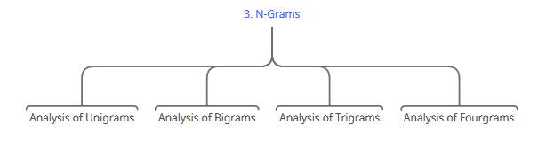
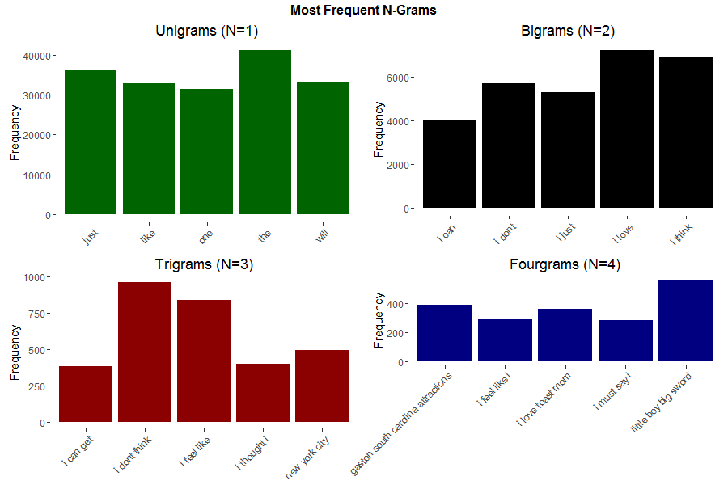

```{r setup, include=FALSE}
knitr::opts_chunk$set(
	echo = TRUE,
	message = FALSE,
	warning = FALSE
)
```
```{r libraries, message=FALSE, warning=FALSE, include=FALSE}
library(knitr)
library(tm)
library(quanteda)
library(SnowballC)
library(ggplot2)
library(gridExtra)
library(reshape2)
library(stringi)
```

### Project Overview
This is the milestone report for the **Coursera Data Science Capstone Project** in which we aim to implement an algorithm to predict the next word, given raw text data that needs to be cleaned and analysed.  
  
The project was developed by **Johns Hopkins University** in collaboration with **Swiftkey**.  
  

----------------------------------------------------------------------------------------

### The Data Description

#### Obtaining the Data  
We obtained the data from the following URL:  
  
[https://d396qusza40orc.cloudfront.net/dsscapstone/dataset/Coursera-SwiftKey.zip](https://d396qusza40orc.cloudfront.net/dsscapstone/dataset/Coursera-SwiftKey.zip)  
  
It is in the form of a 548mb compressed `.zip` folder that contains multiple datasets in various locales or languages; from which we extracted the desired datasets.  

#### Data Loading  

We are required to load three large text files into the `R Workspace`, explore these files and clean them, before we begin with the processing of their content.  


<center></center>


#### Data Sampling and Cleaning

Due to system memory challenges, we reduced the sample size of the data as a random binomial sample of 15% of for each dataset to work with, clean, analyze and visualize.  

The unified document corpus will be compiled from the following three sources  
of text data:  

- Twitter  
- News  
- Blogs  

##  Summarization of the data from the three text files:  

In preparation to construct the unified document corpus and clean the data, a basic  
summary of the three text files has been constructed. This summary includes file  
sizes, number of lines, number of characters, and number of words for each  
source file. Some basic statistics on the number of words per line   
has been summarized.

As the table shows, we have splitted the data on sub-sets as intended.

Outlined below are the pre-processing steps we walked through:

<center></center>

We used the `tm` package to perform these steps and we left the stemming procedure to be performed automatically as we created a **Document Feature Matrix** using the `quanteda` package for each document in the corpus. This was done because stemming using the `tm` package caused word content to be ruined and require a further process called `stemCompletion`.


----------------------------------------------------------------------------------------

### N-Grams 
We used `NGramTokenizer` from the `RWeka` package to find the most frequent **unigrams**, **bigrams**, **trigrams** and **fourgrams**; also to produce the values below:

<center></center>  


<center></center>
----------------------------------------------------------------------------------------

### Further Plans

#### Considerations
* The N-Grams frequency model produced is a random sample of 15% of the dataset. The results have a margin of error based on sampling.  
* If there is a way to create an N-Gram model of the entire dataset without sampling and without affecting app performance, this would produce higher accuracy (reduce the margin of error).   
* We can use a classification algorithm to detect the N-Grams, and then predict accordingly.  
* Further research on the alternative probabilistic models is important before a decision is made on which algorithm to implement.  

#### Algorithm

<center></center>

__Machine Learning__  

* Decision Tree logically must be the fastest algorithm to use if we are to grab the most frequent words of (N + 1) Grams. That essentially means that if a person enters a single word (N = 1), then the most probable next word is a Bigram (1 + 1). Subsequently if a person enters 2 words or 3 words, then we know the next word must come from Trigrams or Fourgrams respectively.  

* SVMs are very efficient, accurate but slower than decision trees when implemented.

* randomForest is a great choice for accuracy, but we must select an optimal number of trees to balance accuracy and computational efficiency.  

__Deep Learning__  

* (ANNs) Artificial Neural Networks present a very different and difficult challange where we must come up with a mathematical model for the algorithm to be implemented. Two great solutions to NLP are (CNNs) Convolutional Neural Netwoks and (RNNs) Recurrent Neural Networks.  

* ANNs are usually _very_ computationally intensive and will restrict us to use a very small sample from the dataset.  

* We might attempt at the implementation of an ANN, however this will be left for later after the machine learning algorithms in the above section have been tested, timed and implemented.  
  
----------------------------------------------------------------------------------------

#### Data Product
  
<center></center>

The concept:

* A text field that takes a string input, and observes an event where (space) is entered after a word.  
* The observed event triggers the prediction algorithm, cancels immediately if the person continues typing.  
* The algorithm results and/or confidence levels are displayed reactively.  
* A bit of UI work can be beneficial for both the user and the developer. An attractive app is an app that more people will use.  
* Deploy the application on [shinyapps.io](http://www.shinyapps.io/).

## Conclusion:  

The JHU Data Science Capstone project will conclude with a predictive algorithm that will be  interfaced using a Shiny application.  The Shiny application will provide the user interface. Structurally, the Shiny app will take as input a phrase or sequence of words in a text box input and generate as output a prediction of the next word.  
  
The predictive algorithm will be developed using an n-gram model with a word frequency look up. This is same approach utilized in the exploratory data analysis. The algorithm strategy will be based on the results realized and gathered during the exploratory analysis. Such that, as n increased for each n-gram, the frequency decreased for each of its terms. A possible algorithm strategy may be to construct the model to first look for the unigram that would follow from the entered text. Once a full term is input and followed by a space, the algorithm would identify the most common bigram model and so on.   
  
Another possible strategy may be to predict the next word using the trigram model. If no matching trigram can be found, then the algorithm would check the bigram model. If still not found, use the unigram model.  


----------------------------------------------------------------------------------------
### Source Code
For access to my GitHub Repository associated with this project, please visit the URL below: at https://github.com/Spyguy3/Data_Science_Capstone.git 
